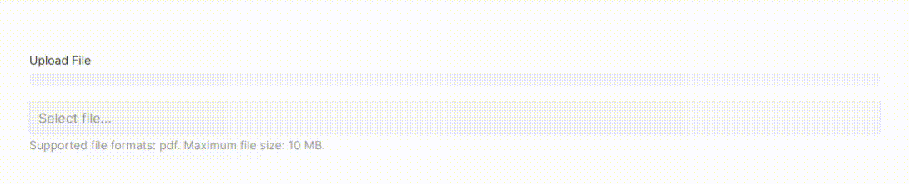

# Wormhole

> Plug and play file uploader for Laravel applications.

Wormhole is a package for Laravel applications that provides a couple of methods which can be used to upload file and store them to different location in server. Make no mistake, Laravel itself provides very convenient way to upload file, and this package is using nothing but Laravel's `Storage` class under the hood. The difference is, methods provided here can be used for multiple purposes. I find myself copying and pasting same code on all of my projects and so I thought to put these methods in a package. Nothing fancy! 

**Plus**, there is a Vue component included with progress bar to show file uploading progress and with configurable front-end validation, which can be published if anyone wants.

Installation
---

To install the package run,

```bash
composer require sowrensen/wormhole
```

Usage
---

There are three methods provided in this package. 

#### 1. saveFile

Use this method to store any binary file. It takes one mandatory and two optional parameters. After successful operation, an auto-generated file name will be returned, you should store this for future use.

Parameter | Type | Required | Default | Description
:---------|:-----|:---------|:--------|:-----------
`$file` | \Illuminate\Http\UploadedFile | Yes | | The file to be uploaded, like, `$request->file('file')`.
`$directory` | string | No | files | The directory name in which the file should be stored.
`$disk` | string | No | public | The Laravel disk name in which the file should be stored.

##### Returns
 
The auto-generated file name.

##### Example

```php
 $filename = \Wormhole::saveFile($request->file('avatar'), 'avatars', 'public');
```

#### 2. saveBase64File

Use this method to store any Base64 encoded file. An example use case of Base64 encoded file when you resize and crop an image in a canvas before uploading. The second and third parameters are same as `saveFile` method. After successful operation, an auto-generated file name will be returned, you should store this for future use.

Parameter | Type | Required | Default | Description
:---------|:-----|:---------|:--------|:-----------
`$data` | string | Yes | | Base64 string, pass like `$request->input('file')`.
`$directory` | string | No | files | The directory name in which the file should be stored.
`$disk` | string | No | public | The Laravel disk name in which the file should be stored.

##### Returns
 
The auto-generated file name.

##### Example

```php
 $filename = \Wormhole::saveBase64File($request->input('avatar'), 'avatars', 'public');
```

#### 3. deleteFile

This method takes one mandatory parameter and one optional parameter. 

Parameter | Type | Required | Default | Description
:---------|:-----|:---------|:--------|:-----------
`$filename` | string | Yes | | Name of the file to be removed (Required)
`$directory` | string | No | files | Name of the directory where the file resides.
`$disk` | string | No | public | The Laravel disk name in which the file is stored.

##### Returns 

`true` or `false` depending on operation status.

##### Example

```php
 \Wormhole::deleteFile('eJd5m08f_1597305889.png', 'avatars', 'public');
```

Vue Component
---

A vue component is provided along with this package which can be used as an interactive input field for uploading large files. The component is provided in two presets, one for Bootstrap and the other for UIKit. The bootstrap version requires jQuery to work while the UIKit version requires the uikit library. However, these are entirely non-compulsory. To use the component, publish the resources by running:

```bash
php artisan wormhole:publish uikit // or, bootstrap
```

`FileUploader.vue` file will be placed at `resources/js/components` directory of your Laravel application. You have to import the component to your `app.js` file. Afterward, you can use it in blade files or other vue components,

```blade
<file-uploader
  url="{{ route('files.upload') }}"
  input-label="Attachment"
  input-placeholder="Select a file..."
  :supported-formats="['pdf', 'doc', 'docx']"
  :max-size="10"
  field-name="attachment"
  :wait="10"
>
</file-uploader>
``` 

The Vue component has seven props and among them only one is mandatory to specify.

Parameter | Type | Required | Default | Description
:---------|:-----|:---------|:--------|:-----------
`url` | string | Yes | | The route to send a post request to your app
`input-label` | string | No | | Label of your input field. It won't be shown unless you set it explicitly.
`input-placeholder` | string | No | 'Choose file' | Placeholder which will be shown upon file input element.
`supported-formats` | array | No | null | Defines which type of files are supported. If you set supported formats, the file format will be validated during selection. Also a helper text related to supported formats will be shown under the input element. 
`max-size` | integer | No | null | Maximum size of selected file in megabyte. If you set the max size property, file size will be validated during selection. Also a helper text related to size will be shown under the input element.
`field-name` | string | No | 'file' | Once the file is uploaded, a hidden input element will hold the returned name of the file as value so that you can save it in database. This property defines the name of that input element.
`wait` | integer | No | 5 | Defines how long the uploader should wait before starting the upload. This waiting time gives user an opportunity to abort the upload and reselect the file.
`notification-position` | string | No | 'top-right' | **Only applicable for UIKit component**. Defines the position of the notification pop-up. See available options [here](https://getuikit.com/docs/notification#position).

### Samples

#### UIKit Component



#### Bootstrap Component


